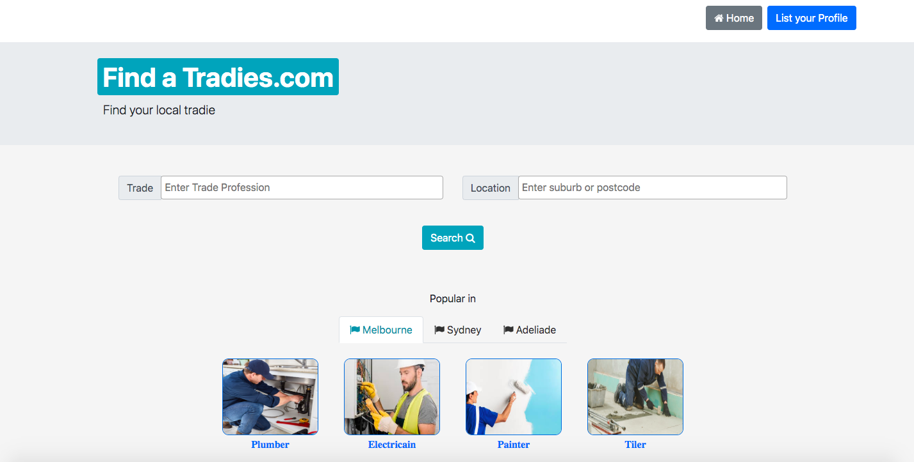
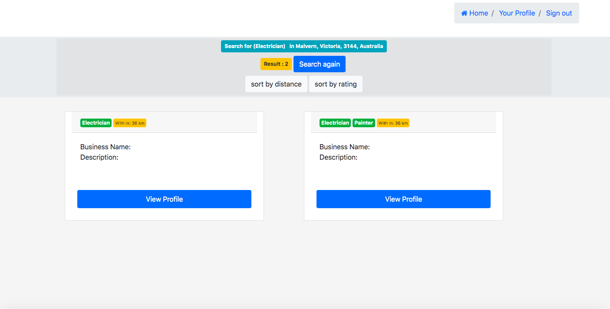
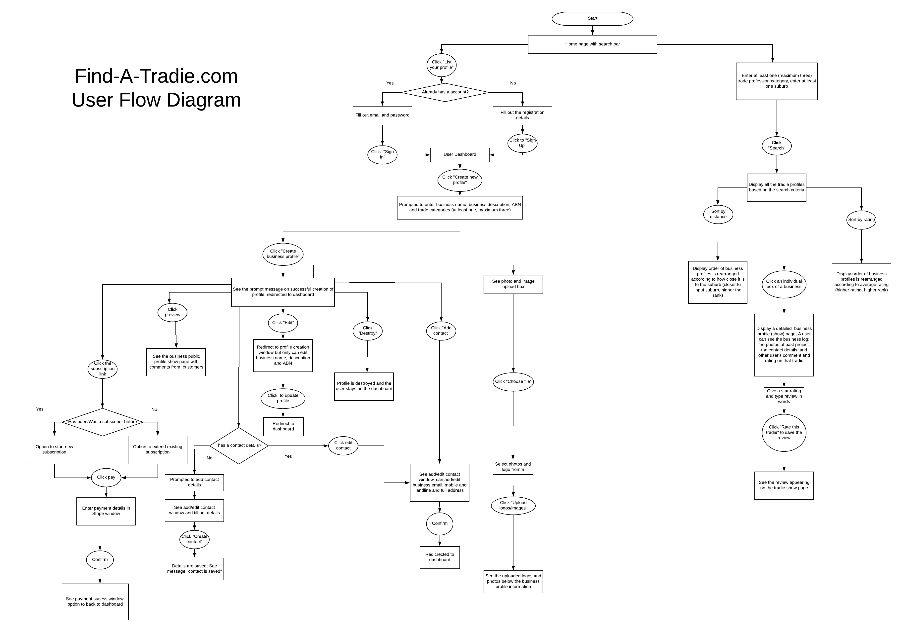
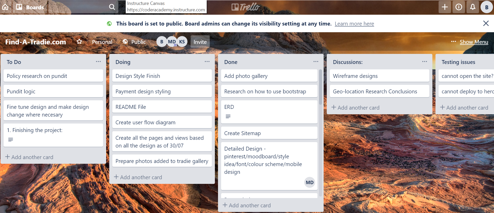
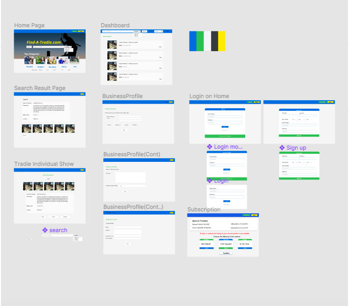
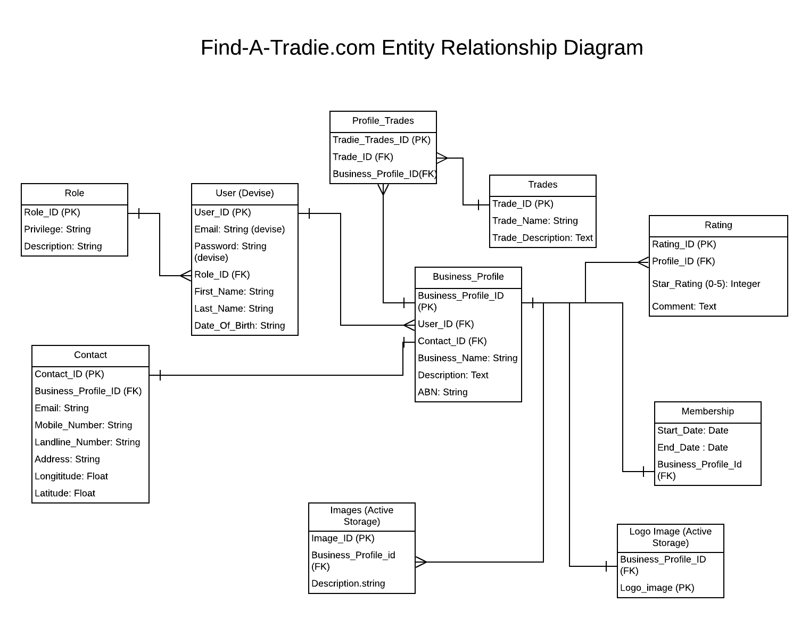

<h2>README - Find-A-Tradie.com</h2>

- deploy-site-url : https://stormy-reef-11998.herokuapp.com/

### Contributor

- github : https://github.com/mos311063
- github : https://github.com/jian10au
- github : https://github.com/MattHDwyer

---

### About/Purpose

Find-A-Tradie is a search engine platform built to assist users in finding a tradesmam to complete the necessary works. Whilst this is inspired from sites such as Yellow Pages, the unique take on this site is that it's aim is to be heavily manipulated around the user reviews. This way encouraging users to search for and find the top rated tradies in their area.

## Functionality

- Search function base on distance and rating
- Sorting base on distance and rating
- Create, Read, Update and Destroy (CRUD) of the Business Profiles
- Login/Signup
- Subscription
- Stripe payment system

## Screenshots




## Tech Stack:

- Backend: Ruby, Ruby on Rails
- Database: POSTGRESQL Database with ActiveRecord
- Deployment: Heroku

## Configuration / Installation Instructions:

1. Within your computer terminal, navigate the directory to where you want to install the application files and run 'git clone git@github.com:MattHDwyer/Find-A-Tradie.com.git'
2. Run 'bundle install' to install the dependencies
3. Run 'rails db:create' to create the database (Warning you must have POSTGRESQL installed!)
4. Run 'rails db:migrate' to migrate the database
5. Run 'rails s' to run the server in development mode
6. In your web browser navigate to 'http://localhost:3000/' to view the site
7. You may now use the site or Sign Up
   Features:
   • Search function for a certain Trade near your address
   • Secure Login, User Authentication and Authorisation
   • User profiles
   • Review of Business Profiles
   • Profile photo upload with AWS image Storage
   • Profile Membership upgrade with Stripe
   Site map:

# Design process

## User Flow



## User Stories

- A visitor wants to look for a plumber to fix leakage problem of his sink tap. He comes to our site and enter his home's location and quickly does a search. He finds a list of 100 plumbers within 50kms of his home. He sorts the lists based on the average rating of the business and finds the photos of that plumber's past projects. He carefully reads the comments left by other customers of that tradie. After he feels confident, he calls that tradie, and arranges a time to get a quote off of him.

- A tradie wants to advertise his business on internet. He just wants to use a cheap and no frill website to publish his business profile. He is happy to pay a small amount of money to list his profile for a period of one month, three months or a year.
In his profile, he wants to add a description and photos to his business profile. He also likes to see customer's feedback on his business and willing to give response to the customer's comments.

### Planning Process

- Figma
  - we start design it via figma and adapt how it look as we coding
- Responsive design
  - we focus on making our app responsive

### Trello



### Wireframe



### ERD



## Short Answer

1. What is the need (i.e. challenge) that you will be addressing in your project?

- The challenge that we looked to address in this project was helping people find good local tradesmen.
  In Australian market, there are three types of websites serving this group of people in general. <br>
  Yellow Pages like Websites: Yellow pages, True locals, or White pages.<br>
  Quotes seeking Website Websites: Hipages, Oneflares, Seekingservice.<br>
  P2P quotes seeking site: Airtask
  Drawbacks of these site:
    - Most of them are heavily quote oriented. This means an average user needs to give away too many personal/job details in order to be able to see a business list generated by system (Airtasker, seekingservice, hipages etc) and can easily get confused and lose the patience of using that site.

- The filtering/sort function of the business directory (index) page is not user friendly. For example, in Yellow Pages, You can do sort by relevance, distance but not the rating/reviews. In Seekservice, you can filter or sort ratings/review number but you cannot filter by distance.
  We aim to create a more user-friendly yellow pages type site from which a person can quickly retrieve a list of tradies. In that list, a person can see the how far that business is from his place, the contact information about that business, and the photos of the past projects from that business and how other people say about the quality of its service. All of these details will be useful for a user to make a decision on choosing the right tradie.
  On the other hand, a tradie business owner can publish the business profile in our site by paying a small amount of money. He can promote the public profile by carefully managing the business descriptions and project photos and replying promptly and his customer’s ratings and comment on his business.
- App development/coding challenge
  Create dynamic search bar hint. <br>
  One of the key feature of the app is to allow user to search tradie within a specified post code area.
  To assist the search, dynamic search hints are provided after the user enter the information. (The app will look for the business name, trade type, and business description and return information based what a user input). This requires us to study and use a little bit of javascript.

- Location-based search
  As mentioned above, to search for a tradie within an area specified by the user. Our code needs to:

    - Store and evaluate the trade's location
    - Store and evaluate the searcher's location
    - Return a result that satisfy the criteria set up by the people who use the search function

This required us to study and understand:

    a. the logic behind any location based serach function

    b. and to use gem 'geolocation' and Google API.
    Allow user to do CRUD operation on his/her profile/pages
    Like most web app, an anthorised User can perform CRUD operation on different pages.

* In our case, a tradie can create, edit and delete his business profiles and manage the listing in his dashboard. Besides, he can add/manage business logo and project photos in specific profile and reply to any comment, an external view leave to his profile.
  
* A user can view the business profile and leave the comment.

* These CRUD operation can be done as designed require us carefully manages the instance variables and related params across the different pages is somehow chanllenging. And the whole process is complicated by the fact that we use scaffold genereated form partial in many cases.

2. Identify the problem you’re trying to solve by building this particular marketplace App? Why is it a problem that needs solving?
   As mentioned above, current sites suffer from two problems:
   i. It asks for too much information input before a user can see any relavant information from a business directory/list.

   - Even after the business directory/list is shown, the most relevant information such as distance and average ratings is not generally an sorting/filter option and this prevents a user making most informed decision.

   - The problems shall be addressed in a better way to improve the information relevance and let user feel more satisfied using any directory type of website. This will also benefit any tradie who uses our site to publish their business profile as a light-weight user-friendly site can attract more customer and bring the tradie more businesses.

   - It is also worth to mention that there's a small issue in Australia of tradesmen overpricing for their work and for the results to be terrible. Our focus on enabling a customer to add reviews can inspire the competitiveness in the industry and increases the standard of work completed.

   - This is a problem that needs solving, because you can't be having people spending thousands and thousands of dollars on work around their house/business and being ripped off by people that are just out here to earn a quick buck. We want tradesmen to be held accountable for their work, as well as making sure the Australian people get good value for their money.

3. Describe the project will you be conducting and how. your App will address the needs
   - We've created a search engine for users, so that they can find local tradesmen in their area. Users will input the type of trade they're looking for (which is provided by the site, they can only look for trades that are already provided) and also their location.
     The home page of the site will send the users straight to the search function. There will also be options for tradesmen to create an account and to sign up to the site, so that they can post their business.
4. Describe the network infrastructure the App may be based on.

   - The site will be deployed onto Heroku. Heroku links with GitHub and passes the necessary code to be able to deploy the site. Heroku is a free service that allows users to store their code on a server so that when a user initiates a HTTP 'Get' Request for their site, the HTTP Response is the code that the developer has created.
     Heroku is a cloud platform as a service supporting many popular language including ruby. Each app run on Heroku has its own unique domain. Each of the application container is called dynos and it is spread across a "dyno grid" which consists of several servers. Heroku's Git server handles application repository pushes from permitted users.<br>
     The infrastructure underpinning Heroku is Amazon cloud service.

5. Identify and describe the software to be used in your App.
   - Frameworks:
    * Ruby on Rails: A web-application framework written in ruby in conjunction with rails to create full-stack web applications. Ruby on Rails is a MVC (Model, View, Controller) framework that emphasises convention over configuration. Rails assists with the automation of time consuming code, when creating such things as routes, controllers,cviews and database migrations.
     
    * Databases:
        - Postgres: A Relational Databse management system
        - Active Record: An ORM or Object Relational Mapping tool, which provides an interface between the tables in a relational database.
     
    * Version Control:
        - GitHub: GitHub is a source control tool which is allows for either solo or group projects to be developed.
    * Deployment:
        - Heroku: Allows you to deploy web applications. It allows you to push directly from Gitub in a variety of different languages.

6. Identify the database to be used in your App and provide a justification for your choice.
   - We've decided to use a POSTGRESQL database for our site. The reason for this decision was because the deployment site that we're using (heroku) works best with POSTGRESQL databse sites.
     In addition, PostgreSQL is generally regarded as the best open-source free database software in 2019 when this app is developed.

7. Identify and describe the production database setup (i.e. postgres instance).
   - When we "rails new"'d for the first time, we added "-d postgresql". This created a local instance of a POSTGRESQL database. We then in the terminal, created the database with the code "rails db:create". After creating the database we were then able to run migrations through the database to create the tables by using "rails db:migrate". We were also able to seed data into the site, by hard coding values for our tables into the seeds.rb file then running "rails db:seed" in the terminal.
8. Describe the architecture of your App.

- Our app let the tradies to post their profile to our site and we use that profile details provide by tradies to generate search tradies website that base on distance so that employer can look for tradies bas on location.
- We also have a lot functionality to improve the result such as rating and sorting algorithyms

9. Explain the different high-level components (abstractions) in your App.

- The foundation of this app is built upon a “model-view-controller” framework (just like any rails app). Models are those related SQL tables storing the information about the users, trades category, and users. The backend ruby codes are called controllers and their function is to retrieve, manipulate, and update the associated SQL tables (database) based on the user input. On the other hand, user interact with these controllers through a series of interface pages which are mainly coded using html and css codes. These interface pages are called view pages.

- App is deployed in the website Heroku. The web framework we use is Rails 5.2.3. Front End Language we use is : HTML with embedded Ruby. A little bit of javascript. Styling language: Pure CSS and CSS Library bootscrap. A payment system: Stripe

10. Detail any third party services that your App will use.
    The main ones are listed as below:

- AWS for storing the photos
- Stripe to manage the payment windows
- GeoCoder Gem: Utilises the Google Map/Earth API to provide the address/location information (to make the GeoCoder work, an internet connection is required)
  Full list of Gems/Dependencies:

```ruby
  • ruby "2.5.2"
  • gem "rails", "~> 5.2.3"
  • gem "pg", ">= 0.18", "< 2.0"
  • gem "puma", "~> 3.11"
  • gem "sass-rails", "~> 5.0"
  • gem "uglifier", ">= 1.3.0"
  • gem "coffee-rails", "~> 4.2"
  • gem "turbolinks", "~> 5"
  • gem "jbuilder", "~> 2.5"
  • gem "devise"
  • gem "pundit"
  • gem "geocoder"
  • gem "bootsnap", ">= 1.1.0", require: false
  • gem 'stripe'
  • gem "byebug", platforms: [:mri, :mingw, :x64_mingw]
  • gem "web-console", ">= 3.3.0"
  • gem "listen", ">= 3.0.5", "< 3.2"
  • gem "spring"
  • gem "spring-watcher-listen", "~> 2.0.0"
  • gem "capybara", ">= 2.15"
  • gem "selenium-webdriver"
  • gem "chromedriver-helper"
  • gem "tzinfo-data", platforms: [:mingw, :mswin, :x64_mingw, :jruby]
  • gem "jquery-rails"
  • gem "bootstrap", "~>4.0.0"
  • gem "font-awesome-rails"
  • gem "select2-rails"
  • gem "ausburbs"
```

11. Describe (in general terms) the data structure of marketplace apps that are similar to your own (e.g. eBay, Airbnb).

- Essentially, our purpose is to have a more user friendly version of yellow pages that focuses on the tradesmen industry. Therefore, site like Yellow Pages or Yelps will be definitely similar but much more complex than our site. Our site aims to be more simplistic than these sites and aims to have more of a user feedback than these sites may have.

12. Discuss the database relations to be implemented.
    

- As our website is essentially an online business directory, most of the CRUD operations directly interact with the business profile. Therefore, Business profile table has most associations with other tables. Among those associations, the four most important ones are with Contacts, Trades, Ratings and Memberships. Contact table contains the address information for a profile and this address needs to be filled out in order for location-based search function to work. A business profile has a many-to-many relationship between trades because we consider a business may set its foots in different industries.
- Allowing a business profile to have many ratings means we let an user post many reviews and comments on one tradie.
- It is also worth mentioning the relationship between an user and business profiles is one-to-many and in our app, we have a dashboard to let a user to manage multiple business profiles attached to his account.

13. Describe your project’s models in terms of the relationships (active record associations) they have with each other.

    We used the following active Record associations:
    -  Business Profile Trade:
        - belongs_to :business_profile
        - belongs_to :trade
    - Busines Profile:
    -  belongs_to :user
    - has_one :contact, dependent: :destroy
    - has_many :business_profile_trades, dependent: :destroy
        -  has_many :trades, through: :business_profile_trades
        -  has_many :ratings, dependent: :destroy
        -  has_many_attached :images
        -  has_one_attached :logo_image
        -  has_one :membership, dependent: :destroy
    - Contact:
        -  belongs_to :business_profile
    - Membership:
        -  belongs_to :business_profile
    - Rating:
        -  belongs_to :business_profile
    - Role:
        -  has_many :users
    - Trade:
        -  has_many :business_profile_trades, dependent: :destroy
        -  has_many :business_profiles, through: :business_profile_trades
    - User:
        -  belongs_to :role
        -  has_many :business_profiles
        -  has_many :contacts


14. Provide your database schema design.


15. Provide User stories for your App.

- A visitor wants to look for a plumber to fix leakage problem of his sink tap. He comes to our site and enter his home's location and quickly does a search. He finds a list of 100 plumbers within 50kms of his home. He sorts the lists based on the average rating of the business and finds the photos of that plumber's past projects. He carefully reads the comments left by other customers of that tradie. After he feels confident, he calls that tradie, and arranges a time to get a quote off of him.

- A tradie wants to advertise his business on internet. He just wants to use a cheap and no frill website to publish his business profile. He is happy to pay a small amount of money to list his profile for a period of one month, three months or a year.
In his profile, he wants to add a description and photos to his business profile. He also likes to see customer's feedback on his business and willing to give response to the customer's comments.

16. Provide Wireframes for your App.
    
17. Describe the way tasks are allocated and tracked in your project.

- The whole development process takes 10 days.
  Discussing the project idea takes one and half day. Wireframe design/user flow design is completed in day 3. Visual design is completed in day 4.
  The whole development process takes 5 days. In developing the app. We always have two people doing the actual coding and leave one person to explore how to achieve the function we want to incorporate into our code. On next working day, the one who did the research needs to report and share his finding with other team member.

* We manage our tasks with starts on morning discussion lists the target we have in the trello board. Each night, the code is pushed into the github and a second person will merge his code into the github master file.

18. Discuss how Agile methodology is being implemented in your project.

- Function development:<br>
  Development starts when the framework is done. Before we start to fine tune the details of design, most of the view pages have been already finished based on the wireframe of the prelimary design.
  During the development process we continually explore the possibly of incorporating the new features as long as we can make it work instead of making it perfect.
- Teamwork:<br>
 Team target and individual’s working objective is set every morning and communicated clearly to other members. Members generally are open about the issues they are facing with and meanwhile, actively offer and seek helps to/from other members. At the end of each day and weeks, each member reports his own working progress and the team and individual to-do lists is updated to reflect changing task priority frequently.

19. Provide an overview and description of your Source control process.

- We used git as our version control, we collaborate via github to work as a team. we create branch for any new feature and push it to the github. One of the team members would review it then decide if it could be merged with our master.

20. Provide an overview and description of your Testing process.

- We populate the database with some seeded data and perform extensive CRUD operations using the seeded data to see whether the web app would behave as intended.

- Besides, we manually input, delete, edit and update a lot of data to make sure the user flow happens as designed.<br>
  Many bugs are found during our testing process. For example, we find our stripe button can update the subscription details, however, there is no backend payment info can be captured by the stripe platform.<br> Another example is that we found that Geocoder allows an user to enter a fake street number and in that case, our app allows an address without a street number stored in the database and this is an unwanted behaviour.

21. Discuss and analyse requirements related to information system security.

- we make sure that the user are only able to do what they expect to do such as non-user login can not access dashboard etc
- most of the security logic are put in pundit and are tested

22. Discuss methods you will use to protect information and data.

- Check if the usesr are matched with server database

- In our app, most of the CRUD operations happens in relation to business profile, and a strong param is enforced everytime we create
or update any business profiles attribute.

23. Research what your legal obligations are in relation to handling user data.

- With the consistent threat of hackers and cyber threats, we have to take the Privacy Laws involving the legal obligations that regulate the collection, storing and provision of access and managemetn of personal information on all individuals very seriously. Whilst handling user data, the legal obligations are that we have to consider the threats that are out there that could compromise user data. We are obligated to protect the individual's files and the systems with authorisation and authentication. We've achieved this in our site through the use of the gem devise and pundit.<br>
  We should also be looking at ways to make sure that our virus protection is up to date on our serverside.
  In addition, it is also important to develop a back up plan or a disaster recovery plan to ensure data recoverability in case of emergencies. This can be done by creating backups of multiple copies in secured multiple locations.
